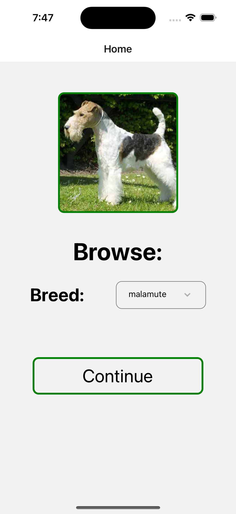
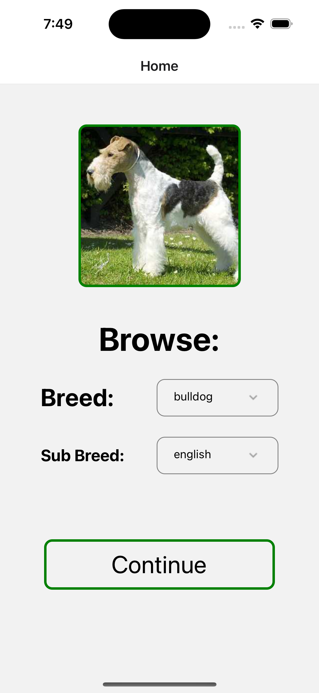
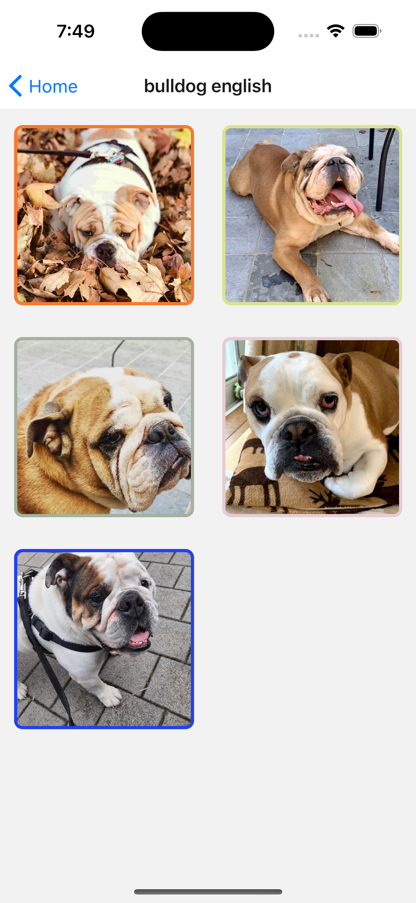
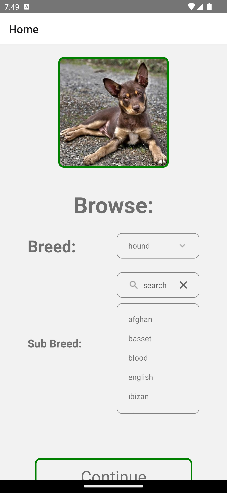
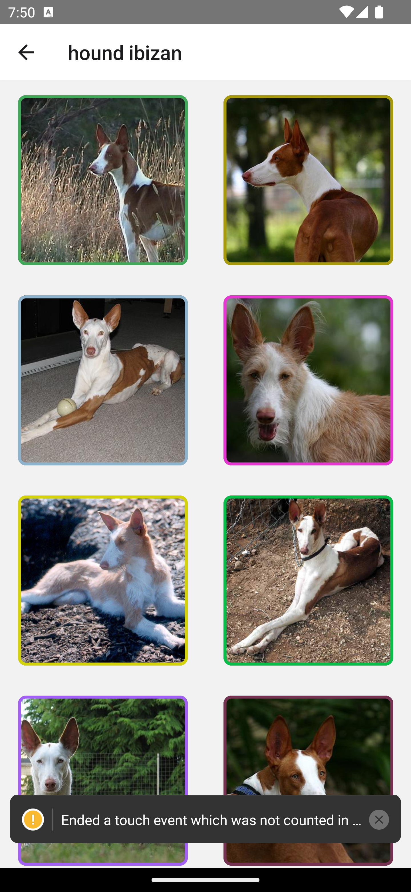
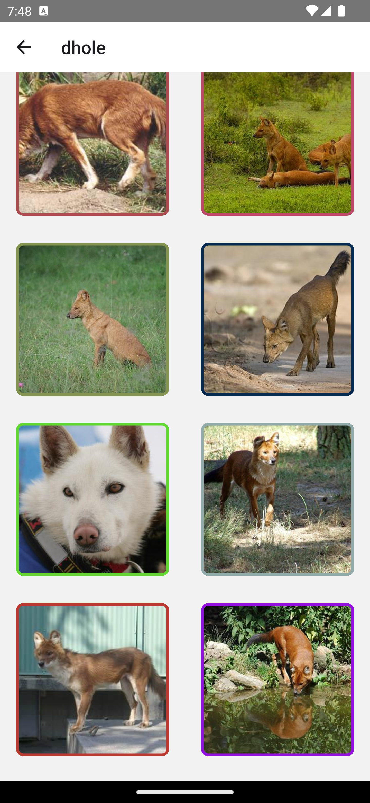

# DogsApp

React Native CLI projects

## APIS
- [React Native Navigation](https://reactnavigation.org/docs/stack-navigator)
- fetch
- FlatList 
- [Select Drop Down](https://www.npmjs.com/package/react-native-select-dropdown)

## API References
https://dog.ceo/dog-api/

## ios

 |

## Android

 |

